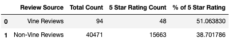

# Amazon Vine Analysis

## Overview of Analysis
The goal of this project is to determine if there is a bias from paid Amazon Vine member reviews of video games.  The Amazon Vine Programis where companies can pay Amazon for reviews of there products.  They send the prodeuct to a vine member and they have to write a review.  Initially the data was loaded in and filtered on the total amount of votes being higher then 20 for each of the reviews to ensure the reviews.  Then it was filtered on having more then 50% of the reviews be voted as helpful to ensure the reviews had some effort put into them and were actually useful. Then statistics were calculated on filtered dataframes, one with paid member and one unpaid, to gauge whether high ratings were more common coming from paid Vine members.

# Results

 
    Initial Data-frame Before any Filters are Added
  

 
    Data-frame Filtered for Reviews Containing 50% Helpful Votes
  

* As you can see above, the initial data-frame included 1,785,997 reviews while the filtered data-frame the only includes the most helpful votes is only 40,565.  The filters may have dramatically decreased the sample size but the remaining reviews are the ones that people put the most effort into and are the most useful.

 
    Data-frame Filtered for Paid Vine Member Reviews
  

* There are only 94 reviews remaining that are from paid Amazon Vine Members.

 
    Data-frame Filtered for Non-Vine Member Reviews
  

* There are 40,471 reviews remaining that are from non-Vine members.  Unfortunately the sample size for paid Vine members is extremely small not only in general but extremely small compared to non-Vine member reviews.  Typically in this case I would alter the parameters slightly to try to see if the sample sizes could be more similar but it is also very interesting that such few of the paid reviews are recognized as helpful.  I will touch more on this in my conclusion.

 
    Basic Stats of 5-star Reviews for Each Data-frame
  

* There were 48 5 star Vine Reviews and 15,663 5 star non-Vine reviews.
* 51% of the Vine reviews were 5 star ratings and 38% of the non-Vine Reviews were 5 star ratings.

# Summary
Based on the percentages alone, it could be assumed there is a positivity bias for Vine member reviews; however, the sample sizes for the 2 groups are so disimilar that it may be inaccurate to say there is a positivity bias. I would be more interested in comparing the helpful reviews for either group.  It would be best to take the compare the total reviews for each group to the filtered hepful reviews. I would more accurately be able to say that maybe the vine reviews are less helpful because the people are paid to get free items and write a review about them, whether the reviews are well done or not.
